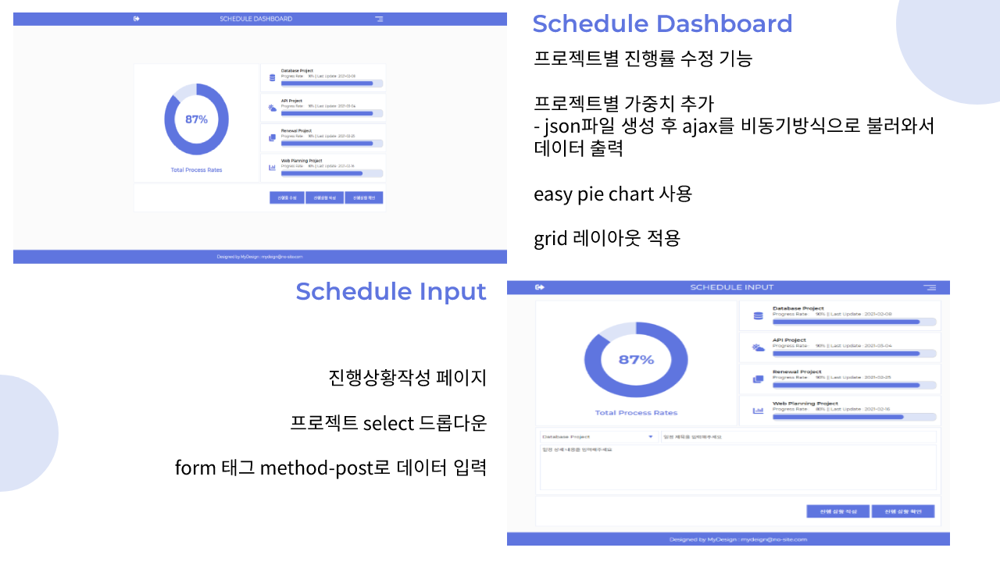
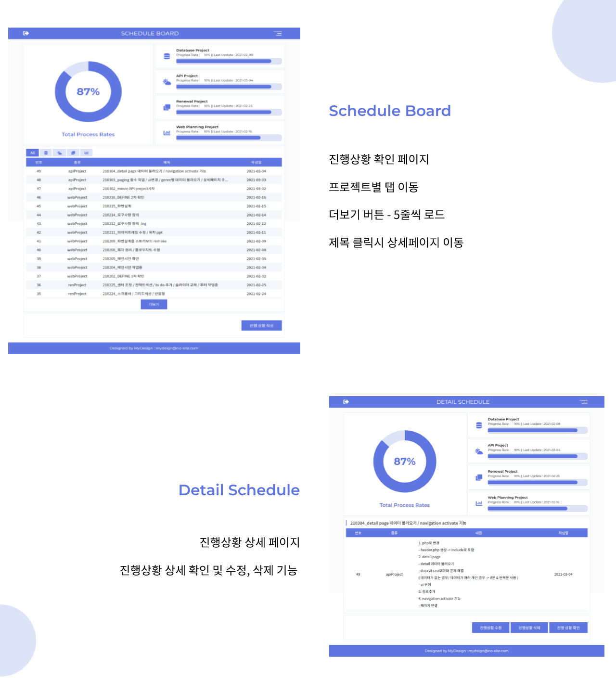
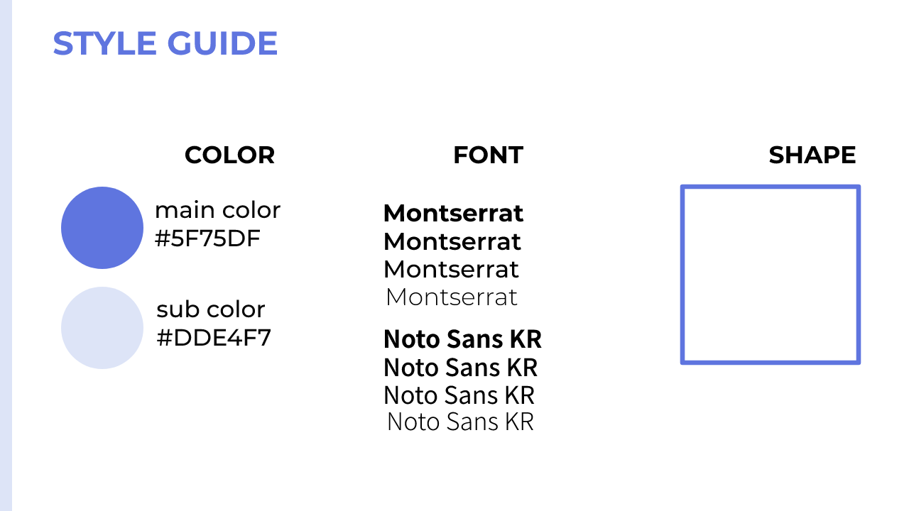
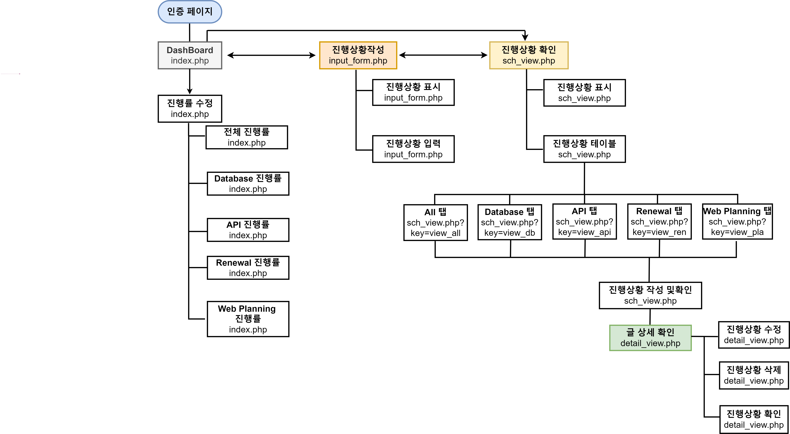

# MY SCHEDULE Project

데이터베이스를 활용한 일정관리용 사이트입니다. 타 프로젝트의 준비 일정을 볼 수 있습니다. 

# 1. 주요화면

---

---

# 2. 사이트 요약

**#일정관리 #진행률수정 #일정등록  #일정수정 #일정삭제 #반응형**

▪️제작기간 : 10일

▪️사이트 진입시 인증페이지 노출

▪️데이터 입력 및 출력

---

# 3. 사이트 전체  구조

---

# 4. 사용 언어

- HTML5
- CSS3
- Javascript
- PHP
- Maria DB

---

# 5. 사용 프레임워크 및 플러그인

- jquery.min.js
- easy pie chart

   -  cdn 링크 사용

---
